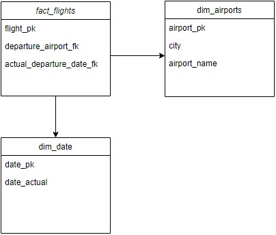

# Построение "легкой" версии DWH по Кимбаллу с целью создания отчета и построения дашборда.

<b>Инструменты</b>: PostgreSQL, PowerBI, DBeaver

<b> База данных:</b> авиаперевозки по России. Скачать можно с [сайта](https://edu.postgrespro.ru/demo-big.zip).

<b> Схема данных: </b>

<b> Выполняем процесс создания хранилища: </b>

- Создаем бд хранилища
- Создаем таблицы staging слоя
- Создаем процедуры загрузки данных в staging слой
- Создаем таблицы core слоя
- Создаем процедуры загрузки данных в core слой
- Создаем таблицы report слоя
- Создаем процедуры наполнения report слоя
- Создаем единую процедуру полного обновления данных
- Создаем визуализацию отчета

<b> Примечание по построению хранилища: </b>
Так как у нас цель построить простую, скромную DWH, то в процессе построения пропустим следующие аспекты: 
1. Загрузка данных с source layer в staging layer будет проводиться не инкрементально, а полным сбрасыванием данных в таблицах и заполнением их с новой информацией.
2. Введение историчности данных в БД не предусмотрено.
3. Так как для отчета нужно будет всего лишь несколько таблиц, то наша схема core layer будет выглядеть следующим образом:

   

<b> Примечание по отчету:</b>
1. Строки: название аэропорта - город аэропорта. 
2. Столбцы - даты вылета. 
3. Значения - кол-во билетов с вылетом из заданного аэропорта в заданный день.
   
<b> Автор: </b>
[eklipsan](https://github.com/eklipsan)
